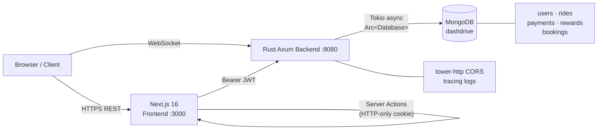

<div align="center">

# 🚖 DashDrive

**A production-grade ride-hailing platform — Rust backend, Next.js frontend, real WebSockets.**


</div>

---

## What Makes This Different

Most ride-hailing demos are React UIs calling a Node.js CRUD API. DashDrive deliberately solves harder engineering problems:

| Challenge | Solution |
|---|---|
| Serve thousands of concurrent ride-tracking clients without blocking | **Rust + Tokio** — every connection is a non-blocking async task |
| Secure payment confirmation without a third-party gateway | **OTP-verified payment flow** — initiate → verify → atomic state transition |
| JWT stored safely, immune to XSS | **Next.js Server Actions** set HTTP-only cookies — token never touches client JS |
| Emergency dispatch as a first-class product feature | **Dedicated `/hospital` route** with priority driver assignment and zero auth required |
| Type safety across the entire API surface | **Serde-serialised Rust structs** — malformed requests are rejected at deserialization, before business logic |

---

## Quick Start

```bash
# 1. Backend (Rust)
cd backend && cargo run --release
# → API live at http://localhost:8080
# → WebSocket at ws://localhost:8080/ws/ride/:ride_id

# 2. Frontend (Next.js)
cd frontend && npm install && npm run dev
# → UI live at http://localhost:3000

# 3. Verify
curl http://localhost:8080/health
# → {"status":"ok","service":"DashDrive API","version":"1.0.0"}
```

**Prerequisites:** [Rust ≥ 1.75](https://rustup.rs) · Node.js ≥ 20 · MongoDB ≥ 6 running locally

---

## Core Features

### 🚗 Ride Booking
- **3-step animated wizard** — Route → Ride selection → Confirm (Framer Motion transitions)
- **Ride Now** and **Schedule Later** modes with date/time picker
- Four vehicle types: `DashCab` · `DashBike` · `DashEV` · `DashAuto`
- AC preference and EV-only flags per booking, fare estimated on the Rust backend
- Pre-book endpoint sets ride status to `pending` until driver assignment

### 🔐 Authentication
- **bcrypt** password hashing (`DEFAULT_COST`) · **JWT HS256**, 7-day expiry
- Token stored in an **HTTP-only cookie** via Next.js Server Action — zero XSS exposure
- Axum `FromRequestParts` extractor (`AuthenticatedUser`) protects every route declaratively

### 📡 Real-Time Ride Tracking
- Native **WebSocket** at `ws://host/ws/ride/:ride_id` built into the Axum binary
- Server pushes `accepted → in_progress → arriving → completed` events over Tokio tasks
- Each connection is isolated to its `ride_id` — no shared global state, graceful disconnect on error

### 💳 OTP Payment Flow
- `POST /api/payments/initiate` → generates 4-digit OTP, stores `Payment` document
- `POST /api/payments/verify-otp` → validates OTP, marks payment `verified` **and** ride `completed` atomically
- All payment endpoints are ownership-gated by JWT `sub`

### 🏆 Gamification Engine
- **6 badges**: Eco Warrior 🌿 · Streak Master 🏆 · Speed Demon ⚡ · Safe Rider 🛡️ · Top Rated 🌟 · Early Adopter 🚀
- **Streak tracking**: `current_streak`, `longest_streak`, `last_ride_date` per user
- **Points balance** returned alongside badges in one unified response
- Users can only claim and view their own rewards (ownership enforced)

### 📋 Subscriptions
Three tiers — **Basic** (free) · **Dash+ Pro** (₹199/mo) · **Dash+ Premium** (₹499/mo) — with a full feature-comparison table on the frontend and live plan upgrade/downgrade via the API.

### 🚨 Emergency Dispatch
A dedicated `/hospital` page triggers `POST /api/rides/emergency` — no authentication required, zero fare, priority driver assigned instantly, animated dispatch UI with a live progress bar.

---

## System Architecture



---

## Authentication & Security

| Layer | Detail |
|---|---|
| Password hashing | `bcrypt` DEFAULT_COST (12 rounds) |
| Token | JWT HS256 · claims: `sub`, `email`, `exp`, `iat` · 7-day TTL |
| Storage | HTTP-only cookie via Next.js Server Action — never in `localStorage` |
| Route guard | Axum `FromRequestParts` extractor — opt-in per handler, no middleware chain to forget |
| Authorisation | JWT `sub` compared to resource `user_id` on every ownership-sensitive endpoint |
| CORS | `tower-http` CorsLayer configured on the Axum router |

```rust
// Any handler becomes protected by declaring this parameter:
async fn get_ride(
    AuthenticatedUser(claims): AuthenticatedUser,  // ← rejects if token invalid
    Path(ride_id): Path<String>,
    State(state): State<AppState>,
) -> AppResult<Json<RideResponse>> { ... }
```

---

## Backend Design

**Language:** Rust 2021 · **Framework:** Axum 0.7 · **Runtime:** Tokio 1.0

| Module | Responsibility |
|---|---|
| `main.rs` | Router assembly, WebSocket handler, server bootstrap |
| `auth.rs` | JWT creation, validation, `AuthenticatedUser` extractor |
| `db.rs` | `AppState { db: Arc<Database> }` with typed collection accessors |
| `errors.rs` | `AppError` enum → HTTP status via `IntoResponse` |
| `models.rs` | `User`, `Ride`, `Booking`, `Payment`, `Reward`, `RideStreak` |
| `routes/rides.rs` | Book · Prebook · Emergency · Get · Cancel · History |
| `routes/payments.rs` | Initiate · Verify OTP · Cancel |
| `routes/subscriptions.rs` | Plans · Subscribe · Cancel |
| `routes/rewards.rs` | Fetch badges + streak · Claim |

**Error handling** — all errors flow through one typed enum; `#[from]` auto-converts MongoDB errors:
```rust
pub enum AppError {
    Unauthorized(String), // 401
    NotFound(String),      // 404
    BadRequest(String),    // 400
    Internal(String),      // 500
    Database(#[from] mongodb::error::Error), // 500 — zero .map_err() boilerplate
}
```

---

## Database Schema

MongoDB · 5 collections · `dashdrive` database

```
users       → _id, name, email, password_hash, phone?, subscription, created_at
rides       → _id, user_id, pickup, dropoff, vehicle_type, status, fare,
              driver_name?, driver_rating?, is_prebook, is_ac, is_ev, created_at
payments    → _id, ride_id, user_id, amount, status, otp, created_at
rewards     → _id, user_id, badge_id, badge_name, icon, unlocked, earned_at?
bookings    → _id, user_id, ride_id, payment_status, otp, created_at
```

**Ride status lifecycle:** `pending → accepted → in_progress → completed | cancelled`  
**Payment status lifecycle:** `pending → verified | cancelled | refunded`

---

## Tech Stack

| | Technology | Version |
|---|---|---|
| **Frontend** | Next.js | 16.2.4 |
| | React | 19.2.4 |
| | TypeScript | ^5 |
| | Tailwind CSS | ^4 |
| | Framer Motion | ^12 |
| **Backend** | Rust (Axum) | 0.7 |
| | Tokio | 1.0 |
| | jsonwebtoken | 9.3 |
| | bcrypt | 0.15 |
| | serde / serde_json | 1.0 |
| | tower-http | 0.5 |
| | thiserror | 1.0 |
| | tracing-subscriber | 0.3 |
| **Database** | MongoDB | 3.1 (Rust crate) |
| **Realtime** | Axum native WebSocket (`axum::extract::ws`) | — |

---

## API Reference

### Auth
| Method | Endpoint | Auth | Description |
|---|---|---|---|
| `POST` | `/api/auth/register` | — | Register, returns JWT |
| `POST` | `/api/auth/login` | — | Login, returns JWT |

### Rides
| Method | Endpoint | Auth | Description |
|---|---|---|---|
| `POST` | `/api/rides/book` | JWT | Instant booking |
| `POST` | `/api/rides/prebook` | JWT | Scheduled booking |
| `POST` | `/api/rides/emergency` | — | Priority hospital dispatch |
| `GET` | `/api/rides/:id` | JWT | Fetch ride by ID |
| `POST` | `/api/rides/:id/cancel` | JWT | Cancel ride |
| `GET` | `/api/rides/user/:user_id` | JWT | Ride history |

### Payments
| Method | Endpoint | Auth | Description |
|---|---|---|---|
| `POST` | `/api/payments/initiate` | JWT | Generate OTP |
| `POST` | `/api/payments/verify-otp` | JWT | Verify OTP → complete ride |
| `POST` | `/api/payments/cancel` | JWT | Cancel payment |

### Subscriptions & Rewards
| Method | Endpoint | Auth | Description |
|---|---|---|---|
| `GET` | `/api/subscriptions/plans` | — | List plans |
| `POST` | `/api/subscriptions/subscribe` | JWT | Upgrade plan |
| `POST` | `/api/subscriptions/cancel` | JWT | Downgrade to Basic |
| `GET` | `/api/rewards/:user_id` | JWT | Badges + streak + points |
| `POST` | `/api/rewards/claim` | JWT | Claim badge |
| `WS` | `/ws/ride/:ride_id` | — | Live status stream |
| `GET` | `/health` | — | Service health |

**Example — book a ride:**
```bash
curl -X POST http://localhost:8080/api/rides/book \
  -H "Authorization: Bearer <token>" \
  -H "Content-Type: application/json" \
  -d '{"pickup":"Koramangala","dropoff":"Whitefield","vehicle_type":"ev","is_ac":true}'

# Response
{"id":"...","status":"accepted","fare":112.5,"driver_name":"Suresh Kumar","driver_rating":4.9,"eta":"4 min"}
```

---

## Project Structure

```
dashdrive/
├── backend/
│   ├── Cargo.toml
│   └── src/
│       ├── main.rs              # Server bootstrap + WebSocket handler
│       ├── auth.rs              # JWT + AuthenticatedUser extractor
│       ├── db.rs                # AppState, Arc<Database>, collection helpers
│       ├── errors.rs            # AppError enum → HTTP responses
│       ├── models.rs            # All domain structs + enums
│       └── routes/
│           ├── auth.rs          # /api/auth/*
│           ├── rides.rs         # /api/rides/*
│           ├── payments.rs      # /api/payments/*
│           ├── subscriptions.rs # /api/subscriptions/*
│           └── rewards.rs       # /api/rewards/*
└── frontend/
    └── src/
        ├── app/
        │   ├── book/            # 3-step booking wizard
        │   ├── login/           # Glassmorphic auth page
        │   ├── pricing/         # Subscription plans + comparison table
        │   ├── hospital/        # Emergency dispatch UI
        │   └── actions/auth.ts  # Server Actions (HTTP-only cookie login)
        ├── components/          # Navbar, Footer, Hero, Testimonials…
        ├── hooks/               # useScrollAnimation
        ├── lib/mongodb.ts       # Mongoose connection cache
        └── services/api.ts      # Typed client for every backend endpoint
```

---

## Environment Variables

**`backend/.env`**
```env
MONGODB_URI=mongodb://127.0.0.1:27017/dashdrive
JWT_SECRET=replace-with-a-long-random-secret
PORT=8080
```

**`frontend/.env.local`**
```env
NEXT_PUBLIC_API_URL=http://localhost:8080
NEXT_PUBLIC_WS_URL=ws://localhost:8080
MONGODB_URI=mongodb://localhost:27017/dashdrive
```

> ⚠️ Never commit `.env` files. Rotate `JWT_SECRET` before any deployment.

---

## Scalability Notes

| Concern | Now | Path to Production |
|---|---|---|
| Concurrency | Tokio async — non-blocking per request | Horizontal Axum instances behind a load balancer |
| WebSocket scale | Per-connection Tokio tasks | Redis Pub/Sub to broadcast events across instances |
| Database | Single MongoDB, `Arc<Database>` | Atlas replica set + indexes on `user_id`, `ride_id` |
| Auth | Stateless JWT | No changes needed — already horizontally scalable |
| OTP delivery | Logged to stdout | Swap to Twilio / AWS SNS in `initiate_payment` |
| Driver matching | Static assignment | Geospatial query + driver availability queue |
| Deployment | Local dev | Vercel (frontend) + Fly.io / Railway (backend binary) |

---

## Engineering Decisions Worth Noting

**1. Rust over Node for the backend** — not a gimmick. Ownership and lifetimes mean entire classes of bugs (null dereference, data races, use-after-free) are compile errors, not runtime crashes. The Axum + Tokio stack handles concurrent WebSocket sessions at zero GC cost.

**2. WebSocket in the same binary** — the ride-tracking socket lives in the same Axum process as the REST API. One binary, one port, one deployment unit. No separate socket server or message broker needed for a single-node deployment.

**3. HTTP-only cookie auth** — the JWT is set server-side via a Next.js `"use server"` action and stored in an HTTP-only cookie. It is physically inaccessible to client-side JavaScript, eliminating the XSS token theft vector present in the `localStorage` pattern that most tutorials use.

**4. Atomic OTP verification** — verifying a payment OTP and completing the associated ride happen in the same handler function. There is no window where a payment is verified but the ride remains open, or vice versa.

**5. `AppError` with `#[from]`** — a single typed error enum handles every failure mode across all handlers. MongoDB errors auto-convert via the `From` derive. No `.map_err(|e| AppError::Database(e))` boilerplate anywhere in the codebase.

---

## License

MIT © 2025 DashDrive
